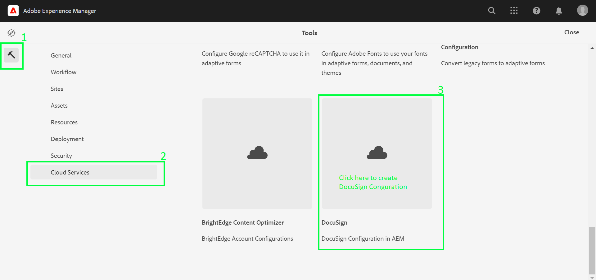
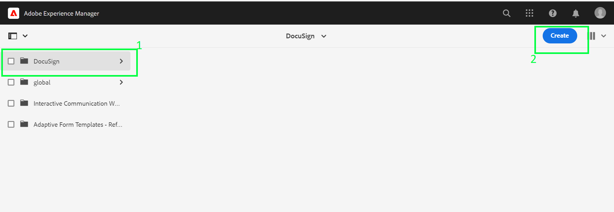
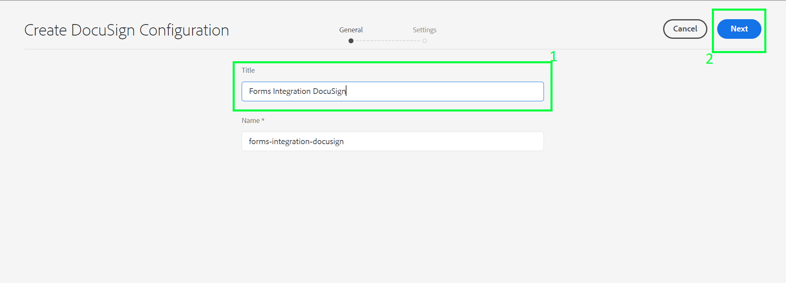
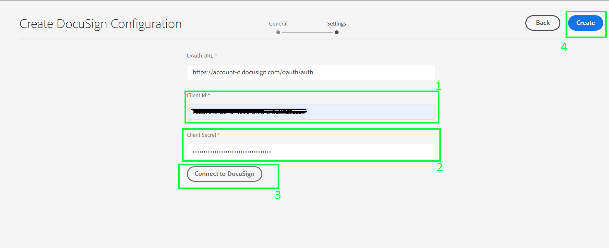
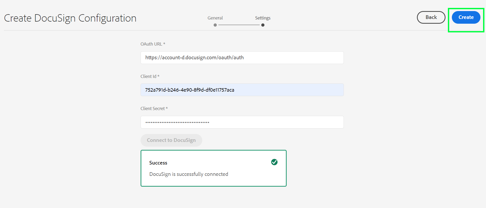
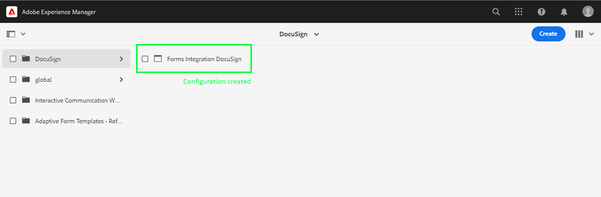

# DocuSign CloudService Setup

## Prerequisites
* AEM FORMS as a Cloud Service
* DocuSign Developer Account and Application

## Steps to Configure
+ Navigate to **Tools -> Cloud Services -> DocuSign**

+ Create a new Cloud Service configuration.

+ Enter the required details.
+ **Title**: Title of your configuration e.g. Forms Integration DocuSign
+ **Name**: Name of your configuration same as Title,automatically populated e.g. Forms Integration DocuSign

+ **OAuth Endpoint Host**: The OAuth Endpoint - https://account-d.docusign.com/oauth/auth
+ **Client ID**: Your DocuSign OAuth App Client ID.
+ **Client Secret**: Your DocuSign OAuth App Client Secret.
+ Click on **Connect to DocuSign** button (will be enabled on adding client secret) - This would establish connectivity between AEM and DocuSign using provided integration credentials.

+ You will be directed to **DocuSign Authentication**. After providing Username and Password you will be redirected to Redirect URL provided in DocuSign Application.

+ Message will indicate the status of Connection to DocuSign.

+ Click on create the configuration.

