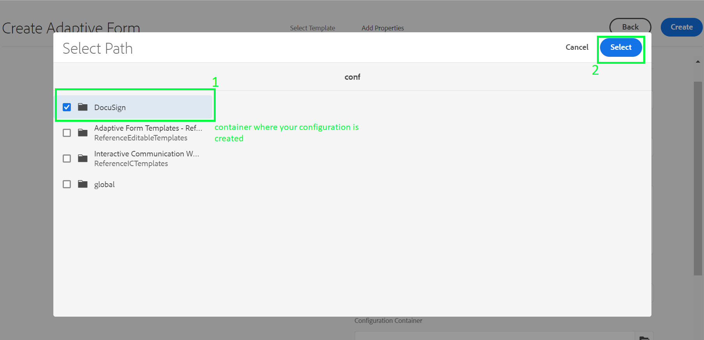

# FORM SUBMISSION SETUP

## Requirements
* During form creation, add the Configuration Container where DocuSign configuration is being created.
* Form should generate Document of Record.

## Configure an Adaptive Form to use DocuSign submit action
+ Create/Edit an Adaptive Form.

+ **Configuration Container**: Select the container in which you created DocuSign Cloud Configuration.

+ **Document of Record Template Configuration**: Document of Record generation is mandatory.

+ Navigate to **Submission** Tab in Form Container.

+ Select DocuSign Custom Submit Action - **Submit with DocuSign electronic signatures**.

+ Add **Recipients** and **Email Subject**.. **Include Attachments** as per requirement.

+ After Form submission, Recipients will get this **Email** to sign the Document of Record.
